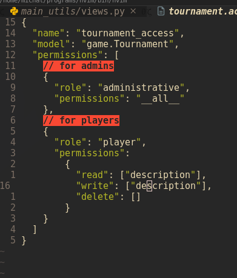

# Why? 😱

There are few reasons. Basically:

- Just to discuss and try different approaches to maintain and load access instances (Permissions) to the system.
- Just to have some fun implementing loading data directly from txt.files.
- Stress testing whole process. Checking how time-consuming that would be with larger files.
- Checking dirrerences between django's `update_or_create` method versions.
- Try to implement access/permissions logic dynamically in some higher places.


# Access files (*.access) 😈

The files that I decided to go with are really simple structures, JSON-like with comments:

<div align="center">
    
</div>


First things first... Sooooo.
After creating access files, we just do:

```python
python manage.py load_access
```

It updates our db, creating new Permissions or updating current ones.

Thanks to that we can just create simple views like these:

<div align="center">
    
</div>

and with correct defined **access files**:

<div align="center">
    
</div>

we control our permissions to each and every **FIELD**:

Exmaple request:

<div align="center">
    
</div>

And as we can see, we only got `description` field serialized and send as response. Which
is correct (look above about defining access file for tournament for role `player`).

# Error handling 🤖

You cannot use a field that is not implemented in model.

<div align="center">
    
</div>

To be fair, I didn't even think I would implement something to this point :D
That was just small quick side-quest. Although, there are nice errors with
pinpoiting exactly where the problem is in our *.access file.

<div align="center">
    
</div>


# Maybe 🥱

There are other thinks that I should think about, for example:
- pagination
- is changing serializer's fields attribute dynamically is correct way to handle 
those kind of problems?
- other http methods
- actually authentication 🤣🤣🤣 For now i just hardcoded id=1 for user in BaseView. But 
that project is just **proof of concept**


